# Tournament Registration Import & Bracket Generation Process

## Overview
This document maps the complete data flow for importing tournament registration XLSX files and generating brackets. Shows all helper methods, transformations, and the roles of each component.

## Process Flow Diagram

```mermaid
graph TD
    A["👤 User Action<br/>Click 'Load Tournament<br/>Registration XLSX'"] -->|File Dialog| B["🎯 main_window<br/>load_tournament_and_generate"]
    
    B -->|filepath| C["⚙️ Thread Manager<br/>_load_tournament_and_generate_thread<br/>Background Thread"]
    
    C -->|Status: 'Reading XLSX'| D["📊 participant_loader<br/>load_participants_from_xlsx<br/>Lines 75-220"]
    
    D -->|Load Config| E["⚙️ ConfigRepository<br/>_ensure_config_loaded<br/>Lines 16-20"]
    E -->|Return config| D
    
    D -->|pd.read_excel<br/>header=1| F["📄 XLSX File<br/>Row 2: Headers<br/>Rows 3-100: Data"]
    
    F -->|Raw Data| D
    
    D -->|Name Data| G["🔗 Helper: Name Combination<br/>Lines 110-125<br/>Vorname + Nachname → Name"]
    G -->|Combined Names| D
    
    D -->|BirthYear| H["🔗 Helper: Age Lookup<br/>config.get_age_group<br/>BirthYear → AgeGroup"]
    H -->|AgeGroup<br/>U9/U11/U13/U15/U18/18+| D
    
    D -->|Weight Data| I["🔗 Helper: Weight Translation<br/>_translate_weight<br/>Lines 23-76"]
    I -->|Converted Weight| D
    
    D -->|Extract Fields| J["🔗 Field Extraction<br/>Handles multiple<br/>column name variants"]
    J -->|Standard Fields| D
    
    D -->|Return| K["📦 raw_participants<br/>List[Dict]<br/>~200 fields preserved"]
    
    K -->|raw_participants| C
    C -->|Status: 40%| L["📊 participant_loader<br/>normalize_participants<br/>Lines 224-273"]
    
    L -->|Field Stdization| M["🔗 Helper: Field Normalization<br/>Case-insensitive mapping<br/>Name, Verein, Weight, etc."]
    M -->|Standardized Fields| L
    
    L -->|Validation| N["✅ Required Fields Check<br/>Name, BirthYear, Gender, Weight"]
    N -->|Valid| L
    
    L -->|Return| O["📦 participants<br/>Normalized List[Dict]<br/>Standard field names"]
    
    O -->|participants| C
    C -->|Status: 50%| P["🎯 Backend Service<br/>export_all_brackets<br/>Lines 103+"]
    
    P -->|Per Age Group| Q["🔗 Generation Pipeline<br/>make_bracket per age group<br/>Generation Methods:"]
    Q -->|Methods| R["📋 Generation Methods<br/>Available in config:<br/>- Random Pool<br/>- Regional Grouping<br/>- etc."]
    
    P -->|Return| S["📦 brackets<br/>Dict[key: Bracket data]<br/>Pre-computed structures"]
    
    S -->|brackets| C
    C -->|Status: 80%| T["💾 Cache Management<br/>Clear caches<br/>save_brackets_to_cache"]
    
    T -->|JSON Cache| U["📁 Cache File<br/>Current Tournament<br/>Fast Reload"]
    
    C -->|Status: 100%| V["✅ Success<br/>Display Group Preview<br/>Show bracket list"]
    
    style A fill:#5f9ea0
    style B fill:#4a90a0
    style C fill:#4a90a0
    style D fill:#6b7a90
    style E fill:#7a8a90
    style F fill:#8a9aa0
    style G fill:#7a8a90
    style H fill:#7a8a90
    style I fill:#7a8a90
    style J fill:#7a8a90
    style K fill:#8a9aa0
    style L fill:#6b7a90
    style M fill:#7a8a90
    style N fill:#7a8a90
    style O fill:#8a9aa0
    style P fill:#6b7a90
    style Q fill:#7a8a90
    style R fill:#8a9aa0
    style S fill:#8a9aa0
    style T fill:#6b7a90
    style U fill:#8a9aa0
    style V fill:#5f9ea0
```



## Component Details

### 1. File Dialog & Thread Management
**Location**: `frontend/views/main_window.py:744-810`

#### `load_tournament_and_generate()`
- Opens file dialog (*.xlsx, *.xls)
- Validates filepath
- Launches background thread for I/O operations
- Shows loading progress UI

#### `_load_tournament_and_generate_thread(filepath)`
- Runs in background (prevents UI freeze)
- Manages progress updates (10% → 100%)
- Coordinates all sub-operations
- Handles errors gracefully
- Caches generated brackets
- Shows group preview on completion

---

### 2. Participant Loading
**Location**: `frontend/utils/participant_loader.py`

#### `load_participants_from_xlsx(file_path)` [Lines 75-220]
**Purpose**: Extract raw participant data from XLSX file

**Process**:
1. Load config blueprint using `_ensure_config_loaded()`
2. Read file with `pd.read_excel(header=1)` (headers at row 2)
3. Drop empty rows
4. Process each row:
   - Extract/combine name fields
   - Extract birth year (handles: Jahrgang, Birth Year, BirthYear, Alter)
   - Extract gender (handles: Geschlecht, Gender)
   - Look up age group from birth year
   - Extract weight
   - Convert weight format
   - Extract all auxiliary fields (Verein, Email, Telefon, etc.)
5. Return list of raw participant dicts

**Dependencies**:
- pandas (Excel reading)
- ConfigRepository (age group lookup)

**Helpers Called**:
- `_ensure_config_loaded()` - Loads ConfigRepository singleton
- `_translate_weight(weight_str, age_group)` - Converts weight format

---

### 3. Helper Methods

#### `_ensure_config_loaded()` [Lines 16-20]
**Purpose**: Lazy-load ConfigRepository singleton

**Returns**: ConfigRepository instance

**Uses**: `config/bracket_config.xlsx` (loaded once, reused)

---

#### `_translate_weight(weight_str, age_group)` [Lines 23-76]
**Purpose**: Convert tournament weight format to bracket system format

**Logic**:
- **U13+**: Converts class notation to weight:
  - "-43kg" → "42kg" (subtract 1)
  - "+100kg" → "101kg" (add 1)
  - "50kg" → "50kg" (no change if no prefix)

- **U9/U11**: Direct weight (no conversion):
  - "30kg" → "30kg"

**Returns**: Converted weight string (empty if invalid)

**Example Flow**:
```
Input: weight_str="-43kg", age_group="U13"
→ Extract "43" from "-43kg"
→ Subtract 1
→ Return "42kg"
```

---

#### `config.get_age_group(birth_year)` [backend/data/repositories/config_repository.py:55-63]
**Purpose**: Look up age group from birth year using config table

**Data Source**: `AgeEligibility` sheet in `bracket_config.xlsx`

**Example Mapping**:
```
BirthYear | U9 | U11 | U13 | U15 | U18 | 18+ |
2014      |    |     | X   | X   |     |     |  → Returns "U13" (first match)
2009      |    |     |     |     | X   | X   |  → Returns "U18" (double start possible)
2018      | X  |     |     |     |     |     |  → Returns "U9"
```

**Handles**: Double starts (birth years eligible for multiple age groups)

---

### 4. Participant Normalization
**Location**: `frontend/utils/participant_loader.py:224-273`

#### `normalize_participants(raw_participants)` [Lines 224-273]
**Purpose**: Standardize field names while preserving all original data

**Process**:
1. For each raw participant dict:
   - Create output dict from original data (keeps all fields)
   - Case-insensitive standardization:
     - `name`/`kampfer`/`fighter` → canonical `Name`
     - `verein`/`club` → canonical `Verein`
     - `geschlecht`/`gender` → canonical `Gender`
     - `alter`/`jahrgang`/`birthyear` → canonical `BirthYear`
     - `gewicht`/`weight` → canonical `Weight`
     - `bezahlt`/`paid` → canonical `Paid`
   - Validate `Name` field (required)
   - Ensure all key fields exist (empty string if missing)
2. Return list of normalized dicts

**Key Feature**: Preserves all original fields, only standardizes canonical names

---

### 5. Bracket Generation
**Location**: `backend/services/bracket_service.py:103+`

#### `export_all_brackets(participants)` [Used at line 788 in main_window.py]
**Purpose**: Generate bracketing structures for all age groups

**Process**:
1. Filter participants by age group
2. For each age group:
   - Select generation method from config
   - Call `make_bracket(age_group_participants, method)`
   - Store result with bracket key
3. Return dict of all brackets

**Bracket Keys**: `{age_group}_{weight_class}` (e.g., `U13_42kg_m`)

---

## Data Structures

### Raw Participant Dict (from load_participants_from_xlsx)
```python
{
    'Name': 'Max Mustermann',           # Vorname Nachname combined
    'Vorname': 'Max',                   # First name
    'Nachname': 'Mustermann',           # Last name
    'Gender': 'm',                       # Single char: m/w
    'Geschlecht': 'm',                  # Duplicate
    'BirthYear': 2009,                  # Integer from Jahrgang
    'Jahrgang': 2009,                   # Duplicate
    'Altersklasse': 'U18',               # Calculated from config.get_age_group()
    'Verein': 'TSC ABC',                # Club name
    'Verband': 'NRW',                   # Federation
    'Weight': '75kg',                   # Translated from tournament format
    'Gewicht': '75kg',                  # Duplicate
    'Bezahlt': 'ja',                    # Payment status
    'Paid': 'ja',                       # Duplicate
    'Email': 'max@example.com',         # Contact email
    'Telefon': '+49123456789',          # Contact phone
    # ... All original XLSX columns preserved
}
```

### Normalized Participant Dict (from normalize_participants)
```python
# Same as above, but with canonical field names guaranteed to exist
{
    'Name': 'Max Mustermann',
    'Verein': 'TSC ABC',
    'Gender': 'm',
    'BirthYear': 2009,
    'Weight': '75kg',
    'Paid': 'ja',
    # All original fields still present
}
```

### Bracket Dict (from export_all_brackets)
```python
{
    'U13_42kg_m': {
        'age_group': 'U13',
        'weight_class': '42kg',
        'gender': 'm',
        'participants': [...],
        'rounds': [...],
        # Generated bracket structure
    },
    'U13_50kg_m': {...},
    'U13_42kg_w': {...},
    # ... One entry per weight class per age group
}
```

---

## Error Handling

### In load_participants_from_xlsx
- **Empty file**: Handled as 0 participants
- **Missing columns**: Soft fail - looks for variant names
- **Invalid numbers**: Falls back to original value
- **Pandas import error**: Raises ImportError with helpful message

### In normalize_participants
- **Non-dict rows**: Skips with warning
- **Missing Name field**: Skips row with warning
- **Empty result**: Raises ValueError

### In _load_tournament_and_generate_thread
- **File access errors**: Caught, displayed in UI
- **Bracket generation errors**: Logged and displayed
- **All exceptions**: Prevent UI threads from crashing

---

## Performance Characteristics

| Operation | Time | Notes |
|-----------|------|-------|
| Excel reading (pandas) | ~100-200ms | 100 rows × ~15 columns |
| Weight translation | O(1) per row | String parsing, minimal overhead |
| Age group lookup | O(1) per row | DataFrame loc + iteration |
| Normalization | O(n) | Single pass through data |
| Bracket generation | Variable | Depends on generation method & pool size |
| **Total** | ~1-3 seconds | 100 participants on average hardware |

---

## Configuration Dependencies

### bracket_config.xlsx - AgeEligibility Sheet
Loaded by `ConfigRepository._load_config()` in `_ensure_config_loaded()`

```
BirthYear | U9  | U11 | U13 | U15 | U18 | 18+ |
----------|-----|-----|-----|-----|-----|-----|
2018      | X   |     |     |     |     |     |
2016      |     | X   |     |     |     |     |
2014      |     |     | X   | X   |     |     |  ← Double start
2012      |     |     |     | X   | X   |     |  ← Double start
2009      |     |     |     |     | X   | X   |  ← Double start
2007      |     |     |     |     | X   |     |
2002      |     |     |     |     |     | X   |
```

---

## File Structure Reference

```
edv_backend/
├── config/
│   └── bracket_config.xlsx           ← AgeEligibility sheet (source of truth)
├── frontend/
│   ├── views/
│   │   └── main_window.py            ← Thread orchestration
│   └── utils/
│       └── participant_loader.py     ← File parsing & normalization
└── backend/
    ├── data/repositories/
    │   └── config_repository.py      ← age_group lookup (get_age_group)
    └── services/
        └── bracket_service.py        ← Bracket generation
```

---

## Key Design Patterns

### 1. **Lazy Loading of Config**
Config is loaded once on first use, cached in module global:
```python
_config = None
def _ensure_config_loaded():
    global _config
    if _config is None:
        _config = ConfigRepository(CONFIG_PATH)
    return _config
```

### 2. **Field Preservation**
Original XLSX fields are preserved for:
- Extensibility (backend can use any field)
- Auditability (no data loss)
- Flexibility (different formats supported)

### 3. **Soft Failures**
Missing columns don't fail - system tries alternatives:
```python
for weight_col in ['Gewicht (U9+U11) [kg]', 'Gewicht', 'Weight', ...]:
    if weight_col in row.index and pd.notna(row[weight_col]):
        weight = str(row[weight_col]).strip()
        if weight and weight != 'nan':
            break
```

### 4. **Background Threading**
Long operations happen off UI thread to prevent freezing:
- File I/O: read_excel
- Config loading: ConfigRepository init
- Bracket generation: export_all_brackets

---

## Testing Considerations

| Component | Test Data | Expected Output |
|-----------|-----------|-----------------|
| `_translate_weight` | "-43kg", age="U13" | "42kg" |
| `_translate_weight` | "+100kg", age="U13" | "101kg" |
| `_translate_weight` | "30kg", age="U9" | "30kg" |
| `get_age_group` | 2014 | "U13" |
| `get_age_group` | 2014 (double) | "U13" (first match) |
| `normalize_participants` | raw list of 100 | normalized list of 100 |
| `load_participants_from_xlsx` | tournament_2026.xlsx | dict with 100 entries |

---

## Future Enhancement Points

1. **User Selection of Age Group** for double starts (currently auto-selects younger)
2. **Weight Validation** against weight class ranges in config
3. **Barcode/QR Scanning** integration from weighin module
4. **Batch Import** multiple tournaments
5. **Import History** tracking (undo, revert)
