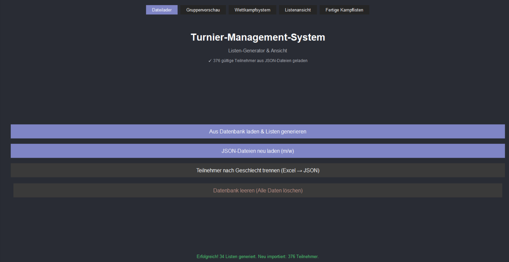
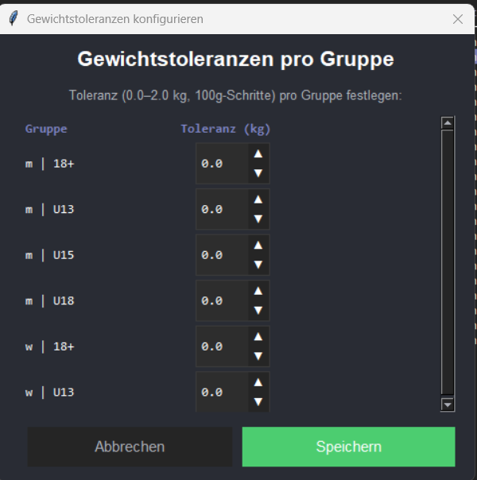
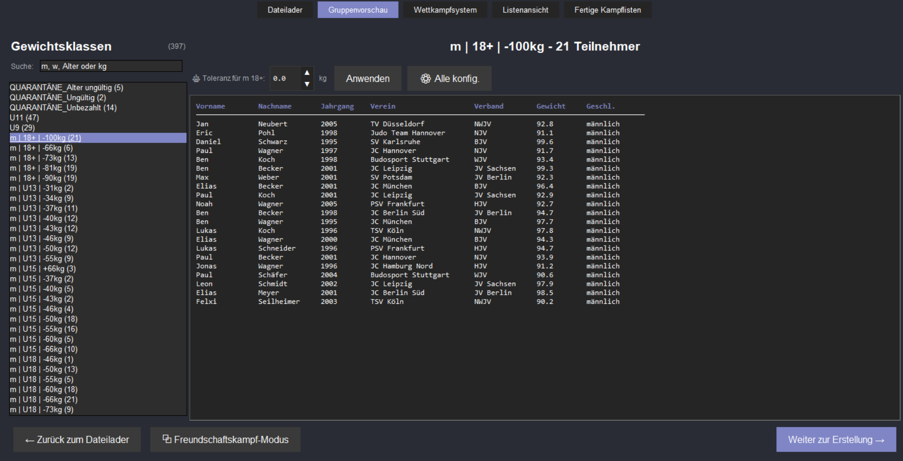
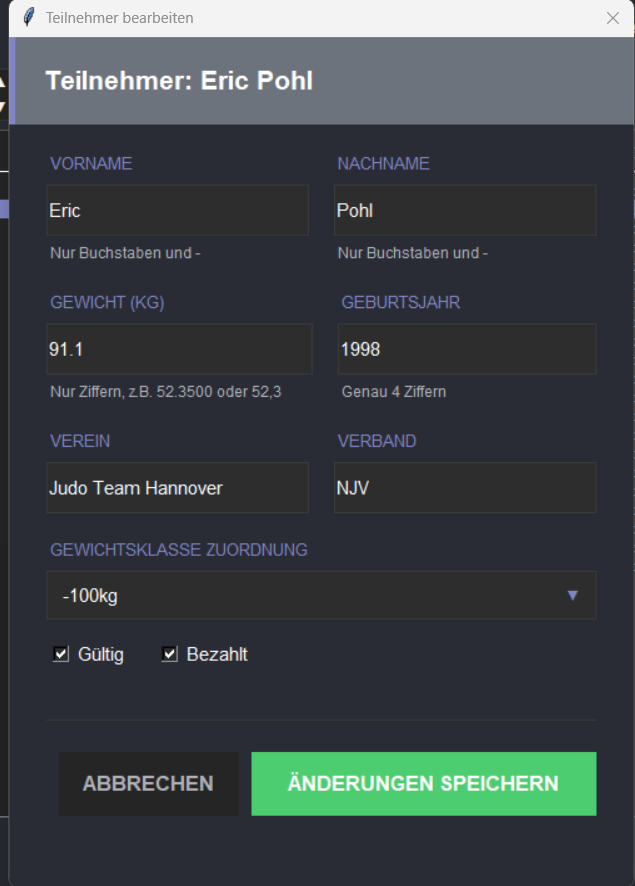
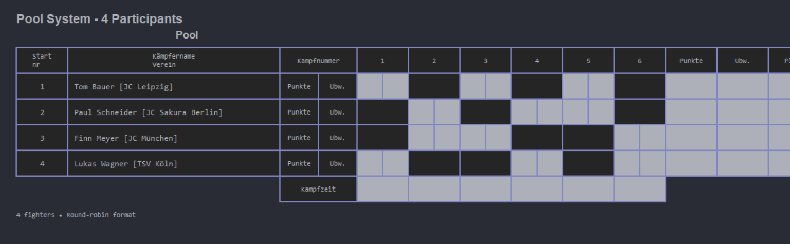
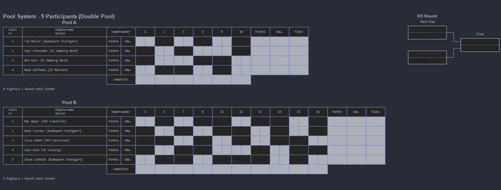
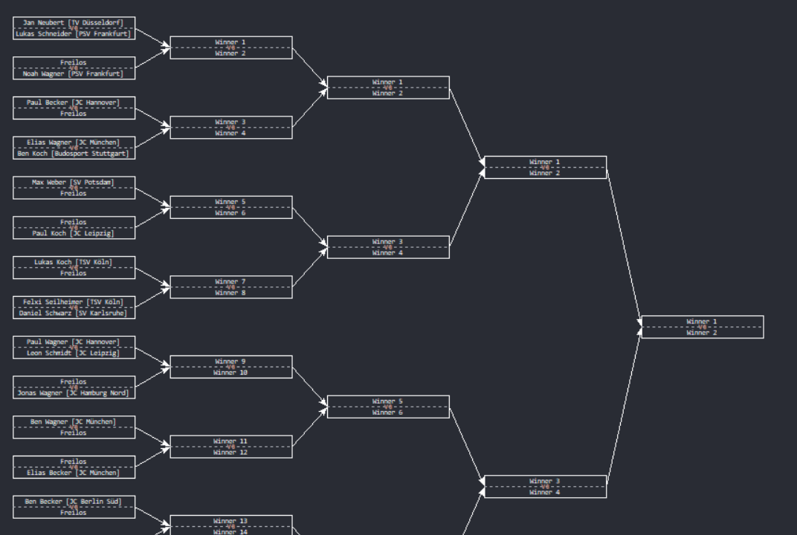
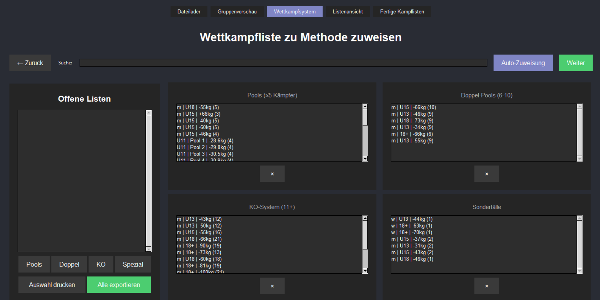
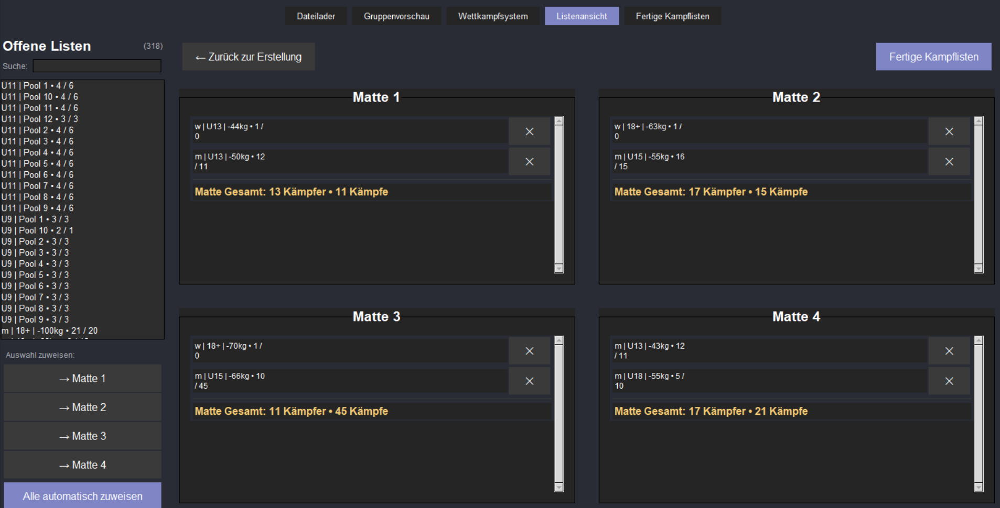

<!-- SPDX-FileCopyrightText: 2026 TOP Team Combat Control
SPDX-License-Identifier: GPL-3.0-or-later -->

# EDV Backend

EDV Backend is a desktop tournament management application for Judo events. It supports importing participant data, reviewing and correcting generated groups, assigning a competition format to each bracket, exporting bracket sheets, and tracking fights during the event.

## Features

- Import participants from PostgreSQL, XLSX, or two gender-split JSON files
- Split an XLSX registration file into male/female JSON files for downstream workflows
- Review generated groups before continuing to bracket generation
- Edit participant data and configure weight tolerances from the UI
- Assign pool, double-pool, or KO-style generation methods per bracket
- Export generated brackets to Excel files in `temp/exports/`
- Monitor fights live and record match results inside the application

## Screens And Workflow

The application follows this main flow:

1. Load data
2. Review groups
3. Adjust participants or tolerances if needed
4. Choose the bracket format for each group
5. View generated brackets and assign mats
6. Run fights and record results

### 1. Data Loading

Use the start screen to load participants from the database, reload two JSON files, or split an Excel registration file into gender-specific JSON files.



### 2. Configure Tolerances

When you split an Excel registration file into JSON, the app asks for weight tolerances per age group and gender before creating the output files.



### 3. Review Groups

After loading data, the group preview lets you inspect the generated groups before you continue to bracket generation.



### 4. Edit A Participant

If a participant needs correction, the edit dialog lets you update personal and tournament-relevant data before continuing.



### 5. Generated Competition Views

Depending on bracket size and the assigned generation method, the application works with pool, double-pool, or KO-style brackets.

Pool view:



Double-pool view:



Double-KO bracket view:



### 6. Fight Monitoring

Once brackets are prepared and assigned, the fight monitoring workflow lets you open a bracket, navigate to the active fight view, and enter results live.

Bracket overview during monitoring:



Fight entry screen:



## Installation

### Prerequisites

- Python 3.10 or newer
- PostgreSQL 15 or newer for normal usage
- `pip`

### 1. Clone The Repository

```bash
git clone <repository-url>
cd edv_backend
```

### 2. Create A Virtual Environment

Windows PowerShell:

```powershell
python -m venv .venv
.venv\Scripts\Activate.ps1
```

Linux or macOS:

```bash
python -m venv .venv
source .venv/bin/activate
```

### 3. Install Dependencies

```bash
pip install -r requirements.txt
pip install -e .
```

### 4. Start PostgreSQL

For normal usage, run the application with PostgreSQL available so groups, brackets, and fight data can be persisted.

Optional Docker-based database setup:

```bash
docker compose up -d db
```

The included `docker-compose.yaml` starts PostgreSQL with these defaults:

- Host: `localhost`
- Port: `5432`
- Database: `mydatabase`
- User: `myuser`

Set the password explicitly before starting the app. The application reads database settings from environment variables:

- `DB_HOST`
- `DB_PORT`
- `DB_NAME`
- `DB_USER`
- `DB_PASSWORD`

Example PowerShell session:

```powershell
$env:DB_HOST = "localhost"
$env:DB_PORT = "5432"
$env:DB_NAME = "mydatabase"
$env:DB_USER = "myuser"
$env:DB_PASSWORD = "mypassword"
```

Example Bash session:

```bash
export DB_HOST=localhost
export DB_PORT=5432
export DB_NAME=mydatabase
export DB_USER=myuser
export DB_PASSWORD=mypassword
```

### 5. Run The Application

From the `edv_backend` directory:

```bash
python -m edv_backend
```

Alternative entry point:

```bash
python main.py
```

### 6. Offline Mode

If PostgreSQL is unavailable, the application can still start in offline mode. That is useful for limited UI checks, but it is not the recommended setup for normal tournament operation because database-backed persistence and reload flows depend on a working PostgreSQL connection.

## Usage

### 1. Choose A Data Source

On the start screen, choose one of the supported input paths:

- Load from database and regenerate brackets from persisted participant data
- Load two JSON files and merge them into the current workflow
- Split one Excel registration file into gender-specific JSON files

The JSON import expects exactly two files. The Excel split workflow opens the tolerance dialog before writing output files.

### 2. Review The Generated Groups

After import, the app opens the group preview. This is the checkpoint for verifying that participants were placed into sensible groups before competition formats are assigned.

Typical actions on this screen:

- Review group composition
- Return to the loader if the wrong source data was used
- Continue to the generation-method step
- Open participant editing when a correction is needed

### 3. Correct Data If Needed

Use the participant editor to fix names, club data, weight, birth year, validity, payment status, and related bracket metadata before proceeding.

### 4. Assign The Generation Method

In the generation-method screen, assign a competition system to each bracket. The application works with three main output styles:

- Pools
- Double pools
- KO-style brackets

After confirmation, the bracket assignments are stored and the app continues to the bracket viewer.

### 5. View Brackets And Export Files

The bracket viewer shows the generated bracket structure and prepares the tournament for operation. From this phase, the application can export Excel files for the currently selected bracket or for all assigned brackets.

Exported files are written to:

```text
temp/exports/
```

### 6. Monitor Fights Live

Use the fight monitoring screen during the event to open a bracket, navigate between mat overview and fight view, and enter match outcomes.

Behavior depends on the assigned bracket type:

- Pool and double-pool brackets support score-cell editing
- Double-pool workflows include a pool-finishing action that fills the KO phase
- KO views allow winner selection directly from the bracket canvas

## Project Structure

```text
edv_backend/
├── alembic/                 # Optional migration history
├── backend/                 # Database layer and business services
├── config/                  # Bracket configuration files
├── frontend/                # Tkinter UI, screen manager, dialogs, views
├── logs/                    # Application logs
├── Readmesource/            # README screenshots
├── temp/                    # Generated output such as Excel exports
├── tests/                   # Automated tests
├── main.py                  # Direct entry point
├── pyproject.toml           # Package metadata
├── requirements.txt         # Python dependencies
└── docker-compose.yaml      # Optional PostgreSQL setup
```

## License

GPL-3.0-or-later