# Application Screen Flow - Accurate Deep Dive

Complete navigation and architecture of the Tournament Bracket Manager based on actual code analysis.

```mermaid
graph TD
    Start["🎬 Application Start<br/>BracketViewerApp.__init__"]
    
    Start --> FileLoaderScreen["📂 File Loader Screen<br/>FileLoaderScreen<br/>file_loader_screen.py:33-197<br/><br/>Entry Point - 4 Import Options"]
    
    %% 4 Data Loading Paths - all run in background threads with progress
    FileLoaderScreen -->|"Load Participant<br/>List XLSX"| LoadAndGenerate["📥 load_and_generate()<br/>main_window.py:680-740<br/><br/>Background Thread:<br/>→ load_participants_from_xlsx()<br/>→ normalize_participants()<br/>→ export_all_brackets()<br/>→ save to cache<br/>→ Show progress dialog"]
    
    FileLoaderScreen -->|"Load Tournament<br/>Registration XLSX"| LoadTournamentAndGenerate["📥 load_tournament_and_generate()<br/>main_window.py:744-807<br/><br/>Background Thread:<br/>→ load_participants_from_xlsx()<br/>&nbsp;&nbsp;&nbsp;with age group calc<br/>→ Normalize participants<br/>→ export_all_brackets()<br/>→ Show progress dialog"]
    
    FileLoaderScreen -->|"Load from<br/>Database"| LoadFromDatabase["🗄️ load_from_database()<br/>main_window.py:808-878<br/><br/>Direct DB Connection:<br/>→ fetch_participants_from_db()<br/>→ export_all_brackets()"]
    
    FileLoaderScreen -->|"Load M/W<br/>JSON Files"| LoadJSONAndGenerate["📄 load_json_and_generate()<br/>main_window.py:879-955<br/><br/>Load two JSON files M/W<br/>→ export_all_brackets()"]
    
    FileLoaderScreen -->|"Split M/W<br/>Contestants"| SplitGenderToJSON["⚙️ split_gender_to_json()<br/>main_window.py:956-1060<br/><br/>Utility: XLSX → JSON<br/>Stays in File Loader context<br/>No forward navigation"]
    
    SplitGenderToJSON --> FileLoaderScreen
    
    %% All 4 paths converge
    LoadAndGenerate -->|Show Progress| ProgressDialog["⏳ Loading Progress<br/>show_loading_progress()<br/>main_window.py:216-264<br/><br/>Modal Dialog<br/>Progress Bar 0-100%"]
    
    LoadTournamentAndGenerate --> ProgressDialog
    LoadFromDatabase --> ProgressDialog
    LoadJSONAndGenerate --> ProgressDialog
    
    ProgressDialog -->|After load complete| GroupPreviewScreen["👥 Group Preview Screen<br/>GroupPreviewScreen<br/>group_preview_screen.py:32-349<br/><br/>Layout:<br/>• Left: Searchable bracket list<br/>• Right: Participant details<br/>• Bottom: Back & Continue"]
    
    %% Group Preview navigation
    GroupPreviewScreen -->|"Button: Back"| FileLoaderScreen
    
    GroupPreviewScreen -->|"Button: Continue"| GenerationMethodScreen["🎯 Generation Method Screen<br/>GenerationMethodScreen<br/>generation_method_screen.py:43-603<br/><br/>Assign brackets to methods<br/>Layout:<br/>• Left: Unassigned brackets<br/>• Right: 4 Method Tables<br/>  - Pools ≤5<br/>  - Double 6-10<br/>  - KO 11+<br/>  - Special Cases"]
    
    %% Generation Method navigation
    GenerationMethodScreen -->|"Button: Back"| GroupPreviewScreen
    
    GenerationMethodScreen -->|"Continue button"| OnGenerationComplete["✅ on_generation_methods_selected()<br/>main_window.py:460-475<br/><br/>Store assignments<br/>{bracket_key: method}"]
    
    OnGenerationComplete --> BracketViewer["📊 BRACKET VIEWER<br/>show_bracket_viewer()<br/>main_window.py:265-456<br/><br/>⚠️ NOT A SEPARATE SCREEN<br/>Complex UI with 2 internal views:<br/>Both in same frame, toggled"]
    
    BracketViewer --> TableAssignmentView["📋 TABLE ASSIGNMENT VIEW<br/>show_tables()/default<br/>main_window.py:477-481<br/><br/>Left Panel:<br/>• Brackets list searchable<br/>• Buttons: → Table 1/2/3/4<br/>• Auto-assign button<br/><br/>Right Panel:<br/>• 4 Physical Tables 2×2<br/>• Each shows assigned brackets<br/>• Click bracket name → visualize<br/>• Click × → unassign<br/>• Fighter count display"]
    
    TableAssignmentView -->|"Click bracket<br/>or double-click"| BracketVisualizationView["🎨 BRACKET VISUALIZATION VIEW<br/>show_bracket_view(bracket_key)<br/>main_window.py:482-490<br/><br/>Canvas-Based Drawing<br/>Rendering depends on method:<br/><br/>• Pools method<br/>  → Pool structure via _render_pool<br/><br/>• Double method<br/>  → Double pool via _render_pool<br/><br/>• KO/Special methods<br/>  → Bracket tree via render_bracket"]
    
    BracketVisualizationView -->|"Controls:<br/>+, −, 100%"| ZoomPan["🔍 Zoom & Pan<br/>zoom_in/out/reset<br/>main_window.py:491-522<br/><br/>Range: 30% - 300%<br/>Mouse wheel scroll<br/>Scrollbars for pan<br/>Updates canvas on change"]
    
    ZoomPan --> BracketVisualizationView
    
    BracketVisualizationView -->|"Back to Tables<br/>button"| TableAssignmentView
    
    TableAssignmentView -->|"← Back to Generation<br/>Setup button"| GenerationMethodScreen
    
    %% Styling
    style Start fill:#5f9ea0,stroke:#4a90a0,color:#fff
    style FileLoaderScreen fill:#6b7a90,stroke:#5a6a80,color:#fff
    style LoadAndGenerate fill:#7a8aa0,stroke:#6a7a90,color:#fff
    style LoadTournamentAndGenerate fill:#7a8aa0,stroke:#6a7a90,color:#fff
    style LoadFromDatabase fill:#7a8aa0,stroke:#6a7a90,color:#fff
    style LoadJSONAndGenerate fill:#7a8aa0,stroke:#6a7a90,color:#fff
    style SplitGenderToJSON fill:#8a9aa0,stroke:#7a8a90,color:#fff
    style ProgressDialog fill:#7a9aa0,stroke:#6a8a90,color:#fff
    style GroupPreviewScreen fill:#6b7a90,stroke:#5a6a80,color:#fff
    style GenerationMethodScreen fill:#6b7a90,stroke:#5a6a80,color:#fff
    style OnGenerationComplete fill:#7a8aa0,stroke:#6a7a90,color:#fff
    style BracketViewer fill:#5a7a90,stroke:#4a6a80,color:#fff,stroke-width:3px
    style TableAssignmentView fill:#6b8a90,stroke:#5a7a80,color:#fff
    style BracketVisualizationView fill:#6b8a90,stroke:#5a7a80,color:#fff
    style ZoomPan fill:#7a8aa0,stroke:#6a7a90,color:#fff
```



## Key Architectural Insights

### 1. Four Screens + Loading Dialog
- **FileLoaderScreen**: Entry point, 4 import options + 1 utility
- **ProgressDialog**: Modal dialog with progress bar (10-100%)
- **GroupPreviewScreen**: Preview loaded brackets
- **GenerationMethodScreen**: Assign brackets to methods
- **BracketViewer**: Complex UI with 2 internal display modes (not separate screens)

### 2. Bracket Viewer is NOT a Separate Screen
The "Bracket Viewer" is actually `show_bracket_viewer()` at line 265 which creates:

```
BracketViewerApp
└── show_bracket_viewer() creates:
    ├── self.tables_frame (Table Assignment View)
    │   ├── Left: bracket list + search
    │   └── Right: 4 physical tables
    │
    └── self.bracket_view_frame (Bracket Visualization View)
        ├── Canvas for drawing
        ├── Zoom controls
        └── Scrollbars
```

These two views are toggled using:
- `show_tables()` - packs tables_frame
- `show_bracket_view(bracket_key)` - packs bracket_view_frame

### 3. Two Display Modes (Not Four)

#### Table Assignment View
- Default view when entering bracket viewer
- Manage which brackets go to which physical table
- Searchable bracket list
- 4 table panels (2×2 grid)
- Click bracket → visualize
- Click × → unassign

#### Bracket Visualization View
- Canvas-based drawing
- Content depends on generation method:
  - **Pools**: Shows pool structure
  - **Double**: Shows double pool structure  
  - **KO**: Shows bracket/tournament tree
  - **Special**: Shows special format
- Zoom: 30% to 300%
- Pan via mouse wheel + scrollbars

### 4. Data Flow

```
File Loading (4 paths + utilities):
├── load_and_generate()                → standard XLSX
├── load_tournament_and_generate()    → tournament format XLSX
├── load_from_database()             → PostgreSQL
├── load_json_and_generate()         → JSON files (M/W)
└── split_gender_to_json()           → utility (XLSX → JSON)

All converge to (except utility):
↓
ProgressDialog (10-100%)
↓
GroupPreviewScreen
↓
GenerationMethodScreen  
↓
BracketViewer (TableAssignmentView default)
↓
Can switch to BracketVisualizationView
```

### 5. Background Threads

All file loading operations run in background threads to prevent UI freezing:
- `_load_and_generate_thread()`
- `_load_tournament_and_generate_thread()`
- `_load_database_thread()` 
- `_load_json_thread()`

Progress updates every 10% via `update_progress()`.

### 6. Navigation Buttons

- **File Loader** → 4 import paths (one direction)
- **Group Preview** → Back to File Loader, Continue to Generation Method
- **Generation Method** → Back to Group Preview, Continue to Bracket Viewer
- **Table Assignment** → Back to Generation Method
- **Bracket Visualization** → Back to Table Assignment

### 7. Data Persistence

- Main window holds `self.brackets` {bracket_key: bracket_data}
- Also holds `self.bracket_generation_methods` {bracket_key: method_name}
- Caches saved to JSON (marked for future removal - DB is source of truth)

---

## Line Reference Summary

| Component | File | Lines | Purpose |
|-----------|------|-------|---------|
| `show_file_loader()` | main_window.py | 140-157 | Initialize FileLoaderScreen |
| `show_group_preview_window()` | main_window.py | 160-183 | Initialize GroupPreviewScreen |
| `show_generation_method_screen()` | main_window.py | 184-215 | Initialize GenerationMethodScreen |
| `show_bracket_viewer()` | main_window.py | 265-456 | Create bracket viewer UI + both views |
| `show_tables()` | main_window.py | 477-481 | Display table assignment view |
| `show_bracket_view()` | main_window.py | 482-490 | Display bracket visualization view |
| `on_generation_methods_selected()` | main_window.py | 460-475 | Callback from generation method screen |
| `load_and_generate()` | main_window.py | 680-740 | XLSX participant list import |
| `load_tournament_and_generate()` | main_window.py | 744-807 | Tournament registration XLSX import |
| `load_from_database()` | main_window.py | 808-878 | PostgreSQL import |
| `load_json_and_generate()` | main_window.py | 879-955 | JSON file import |
| `split_gender_to_json()` | main_window.py | 956-1060 | XLSX → JSON utility |
| `show_loading_progress()` | main_window.py | 216-264 | Modal progress dialog |
| `render_bracket()` | main_window.py | 1191+ | Draw KO bracket on canvas |
| `_render_pool()` | main_window.py | 1369+ | Draw pool structure on canvas |

