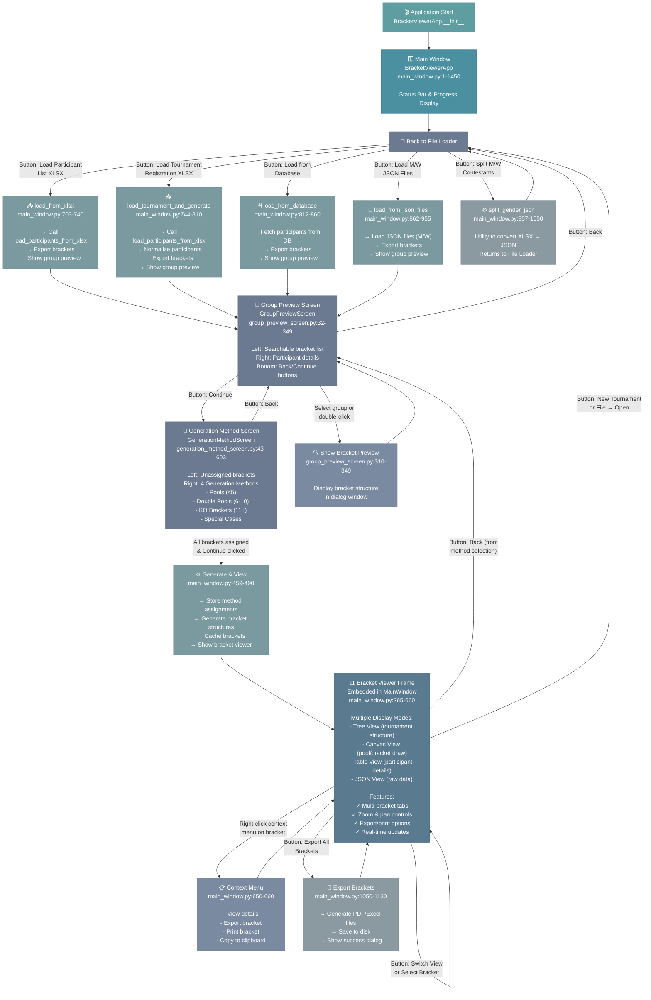

# Application Screen Flow Diagram

Complete navigation map showing all screens and their connections in the Tournament Bracket Manager.



## Screen Navigation Summary

### Primary Flow (Normal Tournament Import)
1. **Main Window** → Application entry point, manages all screens
2. **File Loader Screen** → Select data import method (4 options)
3. **Group Preview Screen** → Review loaded bracket groups & participants
4. **Generation Method Screen** → Assign brackets to generation methods
5. **Bracket Viewer** → Final display of generated brackets

### Utility Flow
- **File Loader Screen** → **Split Gender Utility** → Back to **File Loader Screen**

### Circular Navigation
- **Bracket Viewer** ↔ **File Loader Screen** (load new tournament)
- **Group Preview** ↔ **File Loader Screen** (back button)
- **Generation Method** ↔ **Group Preview** (back button)
- **Bracket Viewer** ↔ **Generation Method** (back button via view mode)

---

## Screen Details

### 1. Main Window
**File**: `frontend/views/main_window.py` (1-1450)

**Purpose**: Main application window and screen orchestrator

**Components**:
- Status bar (top)
- Progress bar / loading dialog
- Main content frame (holds primary screen)
- Menu bar with file operations

**Responsibilities**:
- Initialize all screens
- Route callbacks between screens
- Manage bracket data
- Handle file dialogs
- Cache bracket data

**Key Methods**:
- `show_group_preview_window()` - Display group preview
- `show_generation_method_screen()` - Display method assignment
- `show_bracket_viewer()` - Display final brackets
- `load_from_xlsx()` - Load participant list
- `load_tournament_and_generate()` - Load tournament registration
- `load_from_database()` - Load from PostgreSQL
- `load_from_json_files()` - Load M/W JSON files
- `split_gender_json()` - Split gender utility

---

### 2. File Loader Screen
**File**: `frontend/views/file_loader_screen.py` (33-197)

**Purpose**: Data source selection and import entry point

**Layout**:
- Title & subtitle
- Info label
- 4 primary buttons
- 1 utility button
- Status label

**Buttons** & Actions:
1. **Load Participant List (XLSX)**
   - Opens file dialog
   - Calls `main_window.load_from_xlsx()`
   - Navigates → Group Preview

2. **Load Tournament Registration (XLSX)**
   - Opens file dialog
   - Calls `main_window.load_tournament_and_generate()`
   - Handles tournament-specific format
   - Navigates → Group Preview

3. **Load from Database**
   - Connects to PostgreSQL
   - Calls `main_window.load_from_database()`
   - Navigates → Group Preview

4. **Load M/W JSON Files**
   - File dialog for JSON files
   - Calls `main_window.load_from_json_files()`
   - Navigates → Group Preview

5. **Split M/W Contestants** (Utility)
   - XLSX to JSON converter
   - Calls `main_window.split_gender_json()`
   - Returns to File Loader (no navigation)

**Data Flow**:
- User clicks button
- Dialog or processing begins
- Participants loaded → brackets generated
- Delegates to `main_window` callback
- Callback handles → Group Preview transition

---

### 3. Group Preview Screen
**File**: `frontend/views/group_preview_screen.py` (32-349)

**Purpose**: Preview bracket groups and participants before generation method selection

**Layout**:
- Top: Title with participant count
- Left panel: Searchable bracket list
  - Search box (real-time filter)
  - ListBox of bracket keys
  - Count label
- Right panel: Participant details
  - TkTable display of participants
  - Scrollable
- Bottom buttons: Back & Continue

**Features**:
- Real-time search/filtering
- Participant detail preview
- Optional: Bracket structure preview in dialog
- Click-to-select group

**Interactions**:
- **Search box**: Filter bracket list
- **Back button**: Return to File Loader (reload data)
- **Continue button**: Proceed to Generation Method Screen
- **Double-click group**: Show detailed bracket preview

**Data Display**:
- Bracket keys: `{age_group}_{weight_class}_{gender}`
- Participant table: Name, Club, Birth Year, Weight, Payment Status

---

### 4. Generation Method Screen  
**File**: `frontend/views/generation_method_screen.py` (43-603)

**Purpose**: Assign each bracket to a generation method (Pools, KO, Special)

**Layout**:
- Top: Title
- Left panel: Unassigned brackets
  - Search box (filter)
  - ListBox of unassigned brackets
  - Drag/drop enabled
- Right panel: 2×2 grid of method tables
  - **Pools** (≤5 fighters)
  - **Double Pools** (6-10 fighters)
  - **KO Brackets** (11+ fighters)
  - **Special Cases** (edge cases)
- Bottom buttons: Back & Continue

**Features**:
- Drag-and-drop bracket assignment
- Method-specific assignment buttons
- Visual feedback on assignment
- Search/filter unassigned

**Interactions**:
1. Drag bracket from unassigned → method table
2. OR click bracket + click method button
3. Back button: Return to Group Preview
4. Continue button: Generate & show Bracket Viewer

**Data Storage**:
- `brackets` dict: `{bracket_key: {"tuple": data, "method": method_name}}`
- Passed to `main_window.generate_and_view()`

---

### 5. Bracket Viewer
**File**: `frontend/views/main_window.py` (265-660)

**Purpose**: Display generated brackets in multiple view modes

**Layout**:
- Top: Bracket tabs (one per bracket key)
- View mode selector (tabs): Tree / Canvas / Table / JSON
- Zoom controls (if Canvas mode)
- Pan controls (if Canvas mode)
- Status bar

**View Modes**:

1. **Tree View** (main_window.py:380-450)
   - Hierarchical tree of tournament structure
   - Expandable/collapsible nodes
   - Shows rounds, matchups, participants

2. **Canvas View** (main_window.py:450-550)
   - Visual bracket drawing
   - Zoom & pan support
   - Shows pool structure
   - Supports rendering via `draw_pools_on_canvas()`

3. **Table View** (main_window.py:550-600)
   - Participant table
   - Columns: Name, Club, Weight, Age, Status
   - Sortable

4. **JSON View** (main_window.py:600-650)
   - Raw JSON structure display
   - For debugging/export

**Features**:
- Tab switching between brackets
- Multi-view same bracket
- Zoom levels (Canvas)
- Export/Print options
- Copy to clipboard

**Context Menu** (right-click):
- View bracket details
- Export bracket (PDF/Excel)
- Print bracket
- Copy bracket data

**Buttons**:
- Back: Return to Generation Method Screen
- New Tournament: Return to File Loader
- Export All: Export all brackets

---

## Data Flow Summary

### From File Loader to Bracket Viewer

```
File Selection
    ↓
[Raw Participants from source]
    ↓
normalize_participants()
    ↓
[Standardized Participants]
    ↓
export_all_brackets()
    ↓
[Brackets with generation methods assigned]
    ↓
GroupPreviewScreen(show brackets/groups)
    ↓
User selects Continue
    ↓
GenerationMethodScreen(assign methods)
    ↓
User selects method for each bracket + Continue
    ↓
BracketViewerApp.generate_and_view()
    ↓
[Bracket structures generated]
    ↓
BracketViewerFrame(display final brackets)
```

---

## Key Navigation Patterns

### Pattern 1: Linear Flow with Preview
File Loader → Preview → Method Selection → Viewer

### Pattern 2: Back Navigation
Any screen can return to File Loader or previous screen

### Pattern 3: Context Menus
Right-click in Bracket Viewer shows action menu

### Pattern 4: Utility Function
Split Gender stays within same screen (non-modal)

### Pattern 5: Tab Switching
Within Bracket Viewer, tabs show different brackets

---

## Threading & Background Operations

- **File Loading**: Background thread (prevent UI freeze)
- **Bracket Generation**: Background thread
- **Progress Updates**: Status bar & progress indicator

All long operations delegate to threads managed in `main_window._load_*_thread()` methods.

---

## Configuration & Styling

All screens use centralized styling system:
- **Colors**: `frontend/styles.py:COLORS`
- **Fonts**: `frontend/styles.py:FONTS`
- **Button/Label Styles**: `frontend/styles.py:apply_*_style()`

---

## Future Enhancement Points

1. **Redo/Undo** in Generation Method Screen
2. **Save Tournament State** (save assignments)
3. **Load Tournament State** (reload assignments)
4. **Batch Operations** (multiple tournaments)
5. **Bracket Modification** (edit participants in Bracket Viewer)
6. **Live Scoring** integration (from weighin module)
